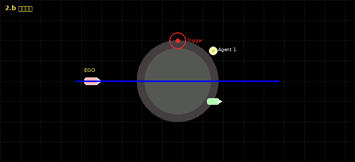

# GB/T 41798—2022 6.2.2 环形路口场景

> 文档关系：首次部署先阅读仓库根目录 [README](../../../README.md) 和 [环境安装与验证](../../environment_setup.md)；实际启动顺序以 [2.b启动与正式实验](startup.md) 为准；字段、单位、国标/工程参数边界和结果目录见 [参数、证据与结果目录](results_and_parameters.md)。本文侧重国标场景、仓库场景及二者对应关系。

## 国标场景定义

本节依据 GB/T 41798—2022 第6.2.2条整理，用于说明测试意图和约束。后续“当前仓库场景定义”与“对应关系”是本项目的仿真实现说明，不应反向解释为标准原文。

### 试验场景

- 试验道路包含不少于3个出入口的环形路口。
- 每个出入口至少为双向两车道。在本场景中，这表示每条接入道路至少有一条驶向环岛的进口车道和一条驶离环岛的出口车道；不表示环岛内部必须有两条环形车道。
- 试验车辆VUT驶入环岛所用入口的上游存在一辆行驶目标车辆VT1。
- 沿环岛规定行驶方向，VUT入口之后遇到的下游第1个车辆入口存在一辆静止目标车辆VT2。

这里必须区分物理接入方向和实际车道口：

- **物理接入方向（arm）**：一组接入道路，至少包含一条朝向环岛的进口车道和一条离开环岛的出口车道。即使同一侧进口与出口因中央分隔带或道路几何相隔一段距离，只要属于同一接入道路体系，仍是一个arm。五臂环岛就是5个arm，而不是10个独立出入口。
- **同方向多车道**：同一物理arm若有两条或更多并行进口车道，仍只标一个arm；出口侧同理。STEP 1只需在该车道组中选择一条代表车道，程序会沿CARLA左右相邻车道关系自动纳入同一道路、同一section且行驶方向一致的Driving Lane。相反，如果OpenDRIVE将其建模为两条彼此独立的接入道路，或两条道路分别接入环岛，即使方位角很接近，也应分别标成两个arm。
- **VUT汇入口**：VUT由接入道路的进口车道汇入环形行车道的位置。它由VUT路线和车道拓扑确定，不是手工Trigger。
- **出口1/2/3**：从VUT汇入口开始，沿VUT路线确定的环流方向，实际依次遇到的第1、第2、第3个出口车道口。五臂环岛还可以继续得到出口4、出口5；VUT入口所属arm的出口侧在完整绕行后才遇到，通常排在最后。VT1规划从出口1驶出，VUT规划从出口2或出口3驶出。
- **下游第1入口**：从VUT汇入口开始沿环流方向实际遇到的下一个进口车道口，VT2放在该进口车道、入口线之前。

出口1按出口车道口的空间顺序确定，下游第1入口按进口车道口的空间顺序确定。二者分别描述“驶出”和“驶入”，不是同一个门线；在进出口错位的arm上尤其不能用arm中心或进出口平均位置代替。二者可能属于同一个物理arm，也可能因实际车道口顺序属于不同arm。

### 试验方法

- VUT在当前车道内驶向环形路口，规划路线从出口2或出口3驶出。
- 当VUT到达环形路口入口时，VT1应仍位于该入口上游。
- VT1以15 km/h匀速沿环岛行驶，规划路线从出口1驶出。
- VT2按试验场景要求静止在下游第1入口。

标准在本条中没有明确给出VUT进入环岛前的具体速度、环岛直径或曲率半径、环岛内部车道数量、VUT与VT1的距离或TTC、VT2距环岛边界的精确位置，以及“到达入口”的具体判定平面。这些内容可在仿真中工程化确定，但必须与国标明确参数区分。

### 通过要求

若被测车辆不具备环形路口行驶功能：

- 应在进入环形路口前发出超出设计运行范围提示信息。
- 不得进入环形路口。

若被测车辆具备环形路口行驶功能，则应同时满足：

- 从规划的正确出口驶出并进入对应车道。
- 不与VT1、VT2发生碰撞。
- 进入环形路口后不出现紧急制动或停止。

项目还叠加标准通用判定要求，包括不得骑轧车道实线、不得违反道路限速和车道导向标线、应按规定使用转向灯等灯光，以及不得与道路基础设施发生碰撞。本项目将同一选定条件生成3次重复试验，只有3次有效试验均满足要求才给出矩阵通过。

## 当前仓库场景定义

本实现沿用现有 `waypoints.py -> JSON -> run.py` 流程。用户在同一个编辑器中放置 VUT、VT1、VT2，并绘制 VUT 与 VT1 路线；程序负责识别环岛、生成门线和保存场景定义。天气与目标车型从YAML读取，同一条路线可展开成多份场景。正式启动器才把每份场景定义展开为3次重复试验并汇总判定。

当前场景使用目标地图中已经存在的唯一环岛结构。用户通过VUT和VT1手绘路线明确本次使用的道路与环岛，不另设 `fixture_id`，也不要求新增专用 `RoundaboutScene` 类。JSON中的 `roundabout_test` 结构化配置和运行时2.b状态机共同构成环岛专项实现。

- VUT由 `ego_start` 和手绘 `ego_route` 定义，路线必须从当前进口进入并从出口2或出口3驶出。
- VT1由带 `vt1` 角色的目标车、起点和手绘路线定义；程序将其目标速度固定为15 km/h并要求从出口1驶出。
- VT2由带 `vt2` 角色的目标车位置定义；程序要求其位于下游第1入口进口车道并全程驻车，不接受运动路线。
- 用户在STEP 1逐个标定物理arm的进口车道和对应出口车道；这些经过程序展开和用户复核的IN/OUT车道组是正式拓扑依据。VUT和VT1都是穿过该拓扑的开放路径，不需要构成圆或完整绕行。编辑器根据路线实际经过的审核车道和有方向门线识别VUT汇入口、出口1/2/3及下游第1入口。
- 正式实验分别运行behavior和TCP两种被测ADS；二者使用相同的场景定义及其正式重复实例，但结果隔离判定。



若使用当前机器的 `carla0916` Conda环境，可直接执行 `./scripts/start_roundabout_editor.sh`。环境检查、CARLA等待和地图名读取的完整说明见 [一键启动说明](startup.md)。

## 国标要求与仓库实现对应关系

| 国标要求或概念 | 当前仓库的表示与实现 | 设置方式 | 运行证据或判定 |
|---|---|---|---|
| 不少于3个出入口 | `roundabout_test.topology.arm_count >= 3`，并保存各接入方向 | 用户逐臂标定，程序展开Driving Lane并由用户复核 | 保存前拓扑校验；三次试验比较 `topology_hash` |
| 每个接入方向至少一进一出 | 每个 `topology.arms[]` 要求 `inbound_lane_count >= 1` 且 `outbound_lane_count >= 1` | 程序扫描Driving Lane | 任一接入方向不完整则禁止保存 |
| VUT驶向环岛 | `ego_start` 位于进口车道，`ego_route`穿越自动入口门线 | 用户放置起点并绘制路线 | 路线连通、入口门线穿越和车道证据 |
| VUT从出口2或3驶出 | `roundabout_test.planned_exit`只能识别为2或3 | 用户绘制并按Enter确认VUT路线；程序枚举出口 | 错误出口、错误车道或路线未完成均不通过 |
| VT1位于VUT入口上游 | VT1起点必须位于环形行车道，并在环流方向上处于VUT汇入口之前 | 用户放置；程序计算所需初始上游弧长 | 建场和VUT到达入口时检查VT1仍在入口上游 |
| VT1以15 km/h匀速行驶 | `roundabout_test.vt1.target_speed_kmh = 15.0` | 程序固定闭环控制 | 稳速窗口、入口时速度和行驶过程证据 |
| VT1从出口1驶出 | VT1手绘路线与自动编号的出口1门线相交 | 用户绘制VT1路线并按Enter确认；程序校验 | 必须观测到VT1实际通过出口1；否则试验无效 |
| VT2位于下游第1入口 | VT2的arm/lane必须匹配 `downstream_entry` 的进口车道 | 用户放置；程序识别下一个入口并校验 | 位置、进口车道、静止状态和夹具碰撞证据 |
| 不具备能力：提示且不进入 | `roundabout_capable=false` 分支 | 用户在编辑器按R选择；提示来自HMI hook或运行窗口O键证据 | 入口前提示且VUT未跨越入口门线才通过 |
| 具备能力：正确出口/车道 | `roundabout_capable=true` 分支 | 用户按R选择，默认具备能力 | 出口门线、允许车道和路线完成联合判定 |
| 不碰撞 | VUT、VT1、VT2碰撞传感器及基础设施分类 | 程序自动 | VUT碰撞为有效失败；非VUT夹具异常按规则标记无效 |
| 入环后不急刹或停车 | 入口门线之后维护制动和速度时间窗 | 程序自动 | `emergency_braking_after_entry`、`stopped_after_entry` |
| 通用限速、实线、导向与灯光要求 | 限速证据、lane invasion、逆行/路线车道代理和转向灯观测 | 程序自动，必要时由地图/HMI适配层提供证据 | 证据缺失时不静默通过；按判定规则FAIL或INVALID |
| 3次重复试验 | 正式启动时为每份场景定义生成trial 1/2/3，仅trial seed不同 | 正式启动器自动；编辑器不生成重复副本 | 三次均为有效PASS时矩阵才PASS |

该对应关系说明本仓库如何实现和采集国标要求，不等同于宣称任何地图、ADS或一次仿真运行已经获得标准符合性认证。工程参数来源和当前证据能力边界见本文后续章节。

## 编辑器操作

所有动态参数统一维护在带注释的 `config/roundabout_2b.yaml`。确认配置后启动：

```bash
./scripts/start_roundabout_editor.sh
```

若自定义地图的 OpenDRIVE 在整条 VUT 路线上都没有可用限速，必须在 YAML 的 `editor.speed_limit_kmh` 填写已确认工程限速。仅连接道缺少限速时，编辑器使用路线中可审计到的最小限速作为保守连接道回退，并在 JSON 中标明来源；不会无记录地猜测限速。

编辑器启动时会立即核对 YAML 的 `connection.expected_map` 与 CARLA 当前地图；不一致时直接报错，不会把场景写到错误的地图键下。

STEP 0和STEP 1是开始车辆编辑前的必经步骤；完成后，车辆对象的放置顺序仍可灵活调整。界面左上角默认使用小字号紧凑状态栏；按 `H` 展开 `STEP 0`～`STEP 7`、详细反馈和最近一次操作。

- STEP 0：按 `Enter` 接受当前能力分支，或按 `R` 切换并确认。
- STEP 1首次使用某地图时：鼠标悬停显示候选门线，绿色 `NEXT Axx IN` 是下一进口，蓝色 `NEXT Axx OUT` 是下一出口；右键固定标记。逐臂标完后按 `P` 运行程序拓扑审核。程序会检查缺失/重复车道、吸附和大致方向，并将代表车道扩展到CARLA相邻同向Driving Lane。用户检查全部高亮，认为正确后按 `Enter`；坐标随即保存为 `config/roundabout_topology/<地图名>_<OpenDRIVE哈希>.json`。
- STEP 1再次打开同一地图时：只有地图完整名称和OpenDRIVE SHA-256都相同才自动加载缓存，并停留在STEP 1等待用户检查，不会直接冒充确认。正确按`Enter`；错误时左键点击任意一条该组IN/OUT高亮（包括双车道中的任一条），再在正确车道位置右键修改，程序立即重新审核；确认后覆盖该地图缓存。没有匹配缓存时自动进入首次绘制流程。
- `V` / `T` / `Y`：分别选择待放置角色 VUT / VT1 / VT2；三种车辆统一使用 `Ctrl + 左键` 放置。普通右键不再放车，避免与STEP 1拓扑修改混淆。
- `Ctrl + 左键`：把当前选择的VUT、VT1或VT2吸附到车道并选中。VUT会生成出口建议；VT1随后绘制路线；VT2只选择下游第1入口的具体进口车道。
- STEP 6放置VT2时，程序立即用CARLA有向lane拓扑检查该点是否能沿`next()`到达审核IN门线，不会因与相邻OUT车道距离很近就误认。若点击的是正确进口车道但已经越过门线或距门线不足2m，程序自动把VT2放到同一车道门线上游2m；该距离是仿真实现的工程固定值，不是国标原始参数。错误arm或出口车道会在放置当场被拒绝，并显示实际lane编号。
- 若OpenDRIVE在上游接入段与门线附近切换了道路或车道编号，VT2配置分别记录`selected_lane`（实际驻车车道）与`gate_lane`（审核门线车道），并以CARLA有向拓扑连通性作为同一进口方向的证据；不会再要求这两个位置必须具有完全相同的`road_id/section_id/lane_id`。
- `左键`：选中 VUT、VT1 或 VT2。
- 选中 VUT 或 VT1 后，`Alt + 右键`：沿实际行驶顺序添加该车辆的路线点，并把路线画到出口下游。程序不会只锁定鼠标最近的一条线；它会收集鼠标附近最多24个CARLA路点候选，对附近各条物理车道逐一执行有界A*车道图搜索，再按“可达性、鼠标距离、变道次数和绕行长度”选择。成功才接收并更新黄色稠密草稿；若最近车道不可达而旁边车道可达，界面会明确提示自动改选，并显示最终`road/section/lane/s`。所有候选均失败时保留原路线、标红失败段并提示重选，无需先撤销。这里的“驶出出口”以车辆路线沿箭头方向**实际穿过目标OUT横门线**为准：STEP 1标定时OUT为蓝色；放置VUT后，同一门线会按派生出口编号改显示为黄色（出口1）、橙色（出口2）或红色（出口3）。最后一个锚点应位于门线下游。终点停在门线之前不算驶出。自定义OpenDRIVE若恰在门线附近切换`road_id`或缺少连接关系，缓存中的编号只作为诊断信息，不再否决物理上连续的路线：路线沿箭头方向穿过用户审核的有限横门线，并继续到门线下游至少2m，即确认驶出；40m有向拓扑搜索仅作为额外证明，不是硬性通过条件。
- `Enter`：首次确认STEP 0测试分支；P生成程序拓扑审核结果后确认STEP 1用户审核；之后确认当前选中的VUT或VT1路线。
- VUT路线确认后，编辑器依据STEP 1人工配对的物理arm自动显示派生结果：此时的`VUT IN GATE`是STEP 1已审核的进口门线，`EXIT n`是沿环流方向得到的出口编号，`DOWNSTREAM-1 IN`是VT2对应入口。等VT1路线也完成后，最终保存阶段才根据VUT与VT1的实际开放路径计算运行时汇入门线。VUT路线必须实际经过所选进口车道，并沿当前候选出口彩色箭头正向穿过出口2或3的审核OUT门线；仅进入同名车道而没有越过门线不算完成。
- VUT刚放置时显示的是“起点阶段初步推荐”：它使用STEP 1已审核的IN/OUT门线帮助选择路线。VUT进口arm按沿`next()`方向**首先到达的审核IN门线**确定；进入环岛后还能到达其他arm属于正常下游交通，不会再被误报为“关联多个arm”。只有两个IN门线在相同最短拓扑距离同时可达时才视为真正歧义。每次添加锚点时，程序在有界局部图内搜索当前Driving Lane的全部`next()`分支及合法左右相邻车道，并用所得实际lane序列和门线穿越正式复核；不会调用全局规划器绕行地图，不会从VUT局部路径拟合圆，也不会要求VUT绕完整一圈。
- VUT起点检查分两层：STEP 3确认VUT路线时先检查其相对审核进口门线的3m上游余量；STEP 5确认VT1路线时，VUT与VT1两条开放路径已经齐备，程序据此生成最终汇合门线并立即复核相同余量。最终门线在VT1路线不存在时无法可靠计算，因此第二层检查的最早合理时点是STEP 5，而不是STEP 3。STEP 6确认VT2时再运行完整场景预检，避免把可提前发现的问题留到`S`。
- 若按`Enter`后的正式复核失败，紧凑面板会用红色多行文字持续显示完整诊断，不再被初步建议覆盖。错误会明确指出路线未经过哪个审核IN/OUT车道、未正向穿过哪条门线，或者实际驶入的物理arm/出口编号；圆半径、环带和固定100m追踪不再是VUT确认条件。
- `C`：清除当前选中的 VUT 或 VT1 路线；VT2 没有路线。
- `Backspace` / `Ctrl + Z`：撤销最近一次成功的车辆放置/删除、路线点添加、路线清空、角色修改或测试分支切换；最多连续撤销 100 步。选择、缩放和平移不改变场景，不进入撤销历史。
- `L`：显示或隐藏完整STEP 1拓扑几何。确认后默认仍保留每个物理arm的一组代表性IN/OUT彩色门线和方向箭头；`L`打开时展开全部同向平行车道标记。`L`只控制几何覆盖范围，不打开文字。
- STEP 1标定和审核阶段始终显示IN/OUT文字，因为操作者必须明确知道当前标的是进口还是出口；不能只依赖颜色。STEP 1按`Enter`确认后才进入默认无文字模式。
- `H`：STEP 1确认后，同时显示或隐藏详细面板与所有2.b地图文字。默认收起时，IN/OUT、EXIT编号、路线锚点编号和车辆名称均不显示，只用颜色区分：进口绿、出口蓝、VUT/入口青、出口1黄、出口2橙、出口3橙红、VT2/下游入口紫。需要再次复核编号时按`H`显示文字，复核后再次按`H`收起。
- 为避免缩放产生整屏色条，所有路线线段均在送入pygame前执行视口裁剪；确认后的稠密路线还按当前缩放动态抽样，使相邻屏幕点保持短距离。两端均在屏幕外的线段不绘制。这只影响显示，不改变Enter冻结的真实路线。
- `Shift + T` / `Shift + Y`：把当前选中的目标车改为 VT1 / VT2。
- STEP 0保存测试能力分支的用户确认。STEP 1同时保存人工标定、P程序审核结果和最终Enter用户目视确认；程序结果不会冒充用户确认。
- `R`：切换测试能力分支并确认STEP 0。
- `P`：运行STEP 1程序拓扑审核并展开全部识别车道，不直接进入STEP 2。扩展并行车道时不要求具有相同`road_id/section_id`：程序同时使用CARLA左右邻接关系和标记门线附近的空间横断面扫描，筛选同向、横向连续的Driving Lane，并合并道路边界处落在同一中心线上的重复身份。这适用于“每条物理车道各自是一个OpenDRIVE road、lane_id均为-1”的自定义地图。审核提示会逐arm列出`IN n / OUT n`，用户仍需检查高亮是否与实际车道一致。
- 路线“驶出某出口”不能仅凭几何相交判定：必须穿过该出口有限宽度的横门线，交点附近的稠密路线必须属于对应审核OUT车道，且运动方向须与OUT箭头一致。横穿出口所在道路或擦过门线端部不会被计为驶出。
- VUT入口归属复用STEP 2放置时完成的“首个可达IN门线”拓扑证明，不要求自定义OpenDRIVE的接入段与门线处始终保持相同`road_id/lane_id`。每次添加VUT锚点都会显示“尚未穿过推荐IN门线”或“已穿过某arm IN门线”；当草稿首次到达任一有效OUT门线时，编辑器立即执行与Enter相同的入口/出口编号复核，失败锚点不会加入路线。
- `X`：清空STEP 1的全部物理arm标定并重新开始；若只错了最后一步，可用 `Backspace/Ctrl+Z` 撤销。

按`S`成功后，场景定义JSON和`2b_scenario_manifest.json`默认写入`save_scenarios/2b/definitions/`。生成数量为`天气配置数 × 车型配置数`。当前默认复用通用方法的15类×8档=120种天气，并配置8组VT1/VT2乘用车，因此一条路线生成`120 × 8 = 960`份场景定义；VUT车型不参与扩展。pygame和终端显示进度及摘要，完整文件表见manifest。
- `Delete`：STEP 1 审核界面中，先左键选中错误的程序展开 IN/OUT 门线，
  再按此键将该横断面从对应 arm 排除；其他步骤用于删除当前选中的车辆。
  人工代表点不能这样排除，应右键移动或按 `X` 重新标定。
- `S`：校验路线，并按YAML中的天气×车型组合生成场景定义；不在编辑阶段复制三次试验。

手工路线点是稀疏导航锚点。按Enter时，程序沿CARLA Driving Lane的前向拓扑自动补全为约1m级连续路线；确认前锚点显示为黄色空心点，确认后的真实VUT路线为青色、VT1路线为橙色并带方向箭头。普通路段推荐每`10～20m`一个锚点；没有分叉的直线可用`20～30m`；分叉、环岛入口、环岛内方向决策点和出口前后应缩短到`5～10m`。不需要每隔1～2m点击。每次添加后终端会报告实际间距；若跨越30m或任意分叉，应补点以消除路线选择歧义。

每个成功接受的锚点都会保存坐标以及精确的OpenDRIVE `road_id/section_id/lane_id/s`，并更新稠密草稿缓存。后续复核优先按这组身份恢复同一车道，不会在重叠连接道处仅按XY重新吸附。Enter不会再重复执行这些已经通过的分段搜索，而是在同一缓存上完成入口、出口及国标关系复核。Enter通过后，后续分析、STEP 6预检和S保存继续直接复用该路线；保存时不会再次规划。生成JSON同时记录VUT和VT1的`route_fingerprint`。任何起点或锚点编辑都会使对应正式确认失效。局部搜索失败时，成功部分显示为灰色、失败候选段显示为红色，并给出分段距离诊断；候选点本身不会加入路线。出口按路线最后一次沿正方向穿过的审核OUT门线判定；此前经过其他辅助OUT门线只记录，不再按重入或重复路线拒绝。

横向边不是无条件“向两侧跳转”：候选车道必须是同road/section的相邻Driving Lane，航向与当前车道一致，横向距离在车道宽度范围内，并且CARLA/OpenDRIVE的`lane_change`允许对应方向；明确的`Solid`/`SolidSolid`边界始终拒绝。每个锚点段最多使用2次横向转换，并给每次转换增加8m搜索代价，因此同车道前向路径始终优先。横向边落在相邻车道约8m前方，形成可执行的斜向变道而不是原地横跳。生成的路线会为横向边写入`RoadOption=CHANGELANELEFT(5)`或`CHANGELANERIGHT(6)`。

界面中的 `V1、V2...` 表示VUT路线锚点，`T1、T2...` 表示VT1路线锚点。VUT和VT1车辆图标本身分别是各自路线起点，界面及保存逻辑都会连接 `VUT→V1`、`VT1→T1`，再依次连接后续锚点。

不需要手工设置 Trigger 或 VUT 入口点。手绘 waypoints 确定所使用的环岛，程序再结合 CARLA Driving Lane 的连通关系推导入口门线、出口 1/2/3 和沿环流方向的下游第 1 个入口。因此也不需要 `fixture_id`；输出中的 `topology_hash` 只用于证明三次试验使用了同一份已识别拓扑，不用于选择环岛。

## 必须由用户设置的内容

- VUT 起点：位于驶向环岛的进口车道。
- VUT 路线：从该入口进入环岛，并从程序识别的出口 2 或出口 3 驶出。
- VT1 起点：位于 VUT 入口上游的环岛车道。编辑器根据 VUT 到实际汇入冲突点的路线距离、15 km/h 的名义接近速度、2 s 建场预算、1 s 稳速窗口、统一冲突时间差、3 m 入口余量和 2 m 缓冲计算最小上游距离；距离不足时在路线首次到达冲突点时提示，并在 STEP 5 拒绝确认。运行时仍保留 15 s 的 VUT 入口到达超时，但超时上限不再被当作布置距离的最小行驶时间。以上均为工程参数，不是国标原始距离或VUT速度参数。
- VUT路线确认后，编辑器先尝试用CARLA `previous()`有向拓扑识别VUT物理汇入点的环流前驱。对于把VUT与环流车建模为互相平行、但没有共同`previous()`节点的自定义OpenDRIVE，程序会改从STEP 1审核的出口1 OUT车道反向搜索，找到它与VUT入口后路线第一次距离小于3m且方向一致的独立车道作为冲突点。随后继续沿有向拓扑反向展开，并在每个路口阻断STEP 1审核的公共道路进口分支，只保留环流连续路径。只有到冲突点的拓扑距离达到当前最小距离的路段才以橙色路点和箭头标成VT1推荐区间；VUT自身进口分支也会被排除。下游第1入口的各条进口车道则从审核门线反向展开2～30m，并以紫色标成VT2推荐区间。推荐色是放置辅助，最终点仍须通过同一套正式校验。
- VT1 路线：沿环流方向行驶并从出口 1 驶出。
- VT2 位置：位于沿环流方向遇到的下游第 1 个车辆入口的进口车道；VT2 不画路线。
- 测试分支：系统具备或不具备环形路口行驶功能。
- 拓扑标定与确认：逐个物理接入方向标定一条进口车道和对应的一条出口车道；当前五向环岛应标定5对。程序随后基于VUT汇入口和环流方向推导出口编号及下游第1入口。

三辆车的初始朝向都由各自 Driving Lane 自动吸附；2.b 不需要也不接受用 `1`～`4` 手工改朝向。

具体找位方法：VT1应在环岛环形行车道上，沿绿色箭头所示环流方向位于VUT汇入口之前，不能放在VUT接入道路；上游距离不足时沿环流反方向继续前移。VT2则从VUT入口沿环流方向寻找下一个接入口，选择箭头朝向环岛的进口车道并放在入口线前，不能选择箭头离开环岛的出口车道。“VT2下游第1入口”和“VT1出口1”是两个独立概念，不要求是同一个接入方向。

点击 `S` 时，若路线不能证明上述关系，或地图拓扑不能证明至少 3 个接入方向且每个方向均至少有一条进口车道和一条出口车道，编辑器会拒绝保存并显示原因。

复杂或带中央分隔带的接入道路由STEP 1人工逐臂配对，程序只展开同一road/section内CARLA相邻且同向的Driving Lane，再交给用户目视复核。正式路线通过保存的lane identity和有方向门线关联到这些物理arm；至少3个完整接入方向且VUT入口成功关联后才编号出口1/2/3，避免把几何圆拟合错误连锁显示成“VUT/VT1走错出口”。

如果上述处理后仍报告接入方向不完整，应检查目标 OpenDRIVE：对应进口车道沿 `successor` 必须能够到达环形行车道，对应出口车道沿 `predecessor` 必须能够回溯至环形行车道。地图上仅有可见车道线或编辑器绿色方向箭头，并不能替代这两组 lane/junction 连通关系。

## 程序自动完成的内容

- 将稀疏手绘点沿CARLA车道中心线补全为开放路径；VUT从入口到出口2/3，VT1从其环流起点到出口1，均不要求构成圆或绕行一周。
- 依据STEP 1审核车道组、路线lane identity和有方向门线识别VUT汇入口、出口1/2/3及下游第1入口；分别使用实际 `outbound_angle` 排列出口、实际 `inbound_angle` 排列下游入口，不把VUT局部路线拟合成整个环岛。
- 校验 VUT、VT1、VT2 的车道连通性和角色数量。
- 自动生成有方向、有限宽度的入口/出口门线，不要求手工入口判定平面。
- 将 VT1 目标速度固定为 15 km/h，并用闭环纵横向控制跟随其手绘路线；VT2 全程驻车。
- 使用同一个 CARLA 仿真时钟维护 SETUP、STABILIZING、APPROACH、IN_ROUNDABOUT、EXITED 和终止状态，以及逐帧事件/采样时间轴。
- VT1稳定到15 km/h后，具备环岛能力分支不会立即释放VUT，而是继续保持VUT，等待VT1到达自动计算的放行位置。程序以VUT起点到共同汇入冲突点的真实路线长度计算放行线，默认使VT1比VUT提前1.0 s穿过冲突点，允许领先0.5～1.5 s；这组时间是工程参数，不是国标原始参数。程序还会自动把“入口上游检查面”放在足够靠前的位置：VUT到达该检查面时，VT1仍须位于入口上游并保持15 km/h；VUT随后真正穿过入口门线时，VT1必须已经先穿过同一冲突点。前一条件不满足属于夹具时序无效并补测；后一条件不满足表示被测ADS抢先汇入，是有效试验FAIL，不得判为PASS。VT2同时必须静止且被测控制器已经就绪。“到达入口检查面”和“穿越入口门线”分别记录，因此VUT到达后为VT1让行不会被误判为建场失败。不具备能力分支不使用交汇同步，也不要求VT1在整个10 s停车观察窗内一直留在入口上游。
- VUT 从正确出口完成路线后，场景继续维护 VT1 的 15 km/h 控制，直到观测到 VT1 实际通过出口 1；20 s 工程窗口内仍未通过则判定为建场无效，而不是让 VUT 获得通过。
- 复用仓库原有天气库，按YAML的`editor.weather_profiles`和`editor.vehicle_profiles`把同一路线展开为多个独立场景定义。当前为120种天气×8组VT1/VT2车型=960份。编辑器连接CARLA后先从车辆蓝图库核对全部目标车型，缺少任一blueprint都会在绘制前报错。正式启动时才为每个完整条件生成索引1、2、3的可复现实例；完整条件指纹包含路线、天气、车型和车辆位置。
- 判定正确出口与对应出口车道、碰撞、环岛内停车或紧急制动、道路限速、车道实线、行驶方向、驶出转向灯和路线完成情况；VT1、VT2 也安装碰撞证据传感器，非 VUT 引起的夹具碰撞或移动会把试验标为 INVALID。车道导向代理以Enter确认后的真实路线中心线建立局部空间走廊，连续偏离走廊才判失败；自定义OpenDRIVE在重叠连接段返回不同`road_id/lane_id`只作为诊断信息，不再单独触发失败。
- 若地图或仿真在测试行驶区间内连续 0.5 s 不能提供道路限速等必需证据，试验记为无效并自动补测，不会把“仅在进口道观测过一次”当作全程可判定。
- 对“不具备环岛行驶功能”分支，检查入口前收到外部 ODD/HMI 提示且 VUT 未进入环岛。
- 以20 Hz输出逐帧CARLA真值、逐次摘要和三次试验量化汇总；均值/标准差仅用于稳定性分析，只有同一condition的三次有效试验全部通过，正式判定才通过。字段和单位见[参数、证据与结果目录](results_and_parameters.md)。

## 运行与结果

正式实验包含 behavior 与 TCP 两种不同 ADS。二者使用同一批场景定义；启动器为每个定义自动准备3次实例，结果分别判定和保存。先在 YAML 的 `ads.tcp.model_path` 填写 checkpoint，然后执行：

```bash
./scripts/run_roundabout_experiments.sh
```

启动器在运行前校验所有场景定义、地图、TCP checkpoint和CUDA要求，并建立独立的`<experiment_root>/batch_<UTC>/`批次目录，在其`prepared_scenarios/`中为每个定义自动展开3次正式实例，然后按`behavior -> tcp`完成两种ADS实验。编辑器输出不会被改写。behavior与TCP分别位于批次目录的`behavior/`和`tcp/`；两者不会混合成一个通过结论。
TCP 摄像头会把 CARLA BGRA 明确转换为 RGB，并等待与当前 world snapshot 相同的 `image.frame`；2.b局部路线根据稠密车道序列推导出的`RoadOption`也会传给TCP，而不是把出口指令全部降级为`LANEFOLLOW`。

运行窗口中的证据键只记录已经真实发生的外部现象，不会替被测系统操纵车辆：

- `O`：记录操作员已经观察到 ODD/HMI 超出设计运行范围提示。
- `I`：记录独立观察到 VUT 使用右转向灯；应在驶过规划出口门线前的 3 s 工程观测窗口内记录。若 CARLA 车辆灯光状态可读，程序也会自动采集该证据。
- 关闭窗口：把当前尝试标记为操作员中止的无效试验，并停止后续试验。

每种 ADS 都写出兼容索引 `2b_result.md/.json/.csv/.pkl`，并按`route/condition/trial/attempt`保存`condition.json`、`summary.json`、`telemetry.csv.gz`、`events.json`、视频和SHA-256清单。仿真或前置条件未正确建立的试验记为 `trial_valid=false`、`pass=null`；运行器按 YAML 的 `runner.max_invalid_retries` 自动补测，并保留每次 `attempt_index`。不同批次、ADS、condition和attempt不会覆盖。被测控制器在试验开始后的碰撞或控制故障记为有效试验失败。完整目录见[参数、证据与结果目录](results_and_parameters.md)。

场景终止后，运行器用连续 GNSS heartbeat 推进并确认两个排空帧，仅接收不晚于终止帧的碰撞/压线证据；若帧屏障超时，本次试验为 INVALID，不会用固定墙钟等待后直接给出 PASS。

不具备环岛能力时，正式结果不接受 JSON 中预填的“已经提示”作为证据。可在真实提示发生时按 `O`，或由被测系统/HMI 适配层调用当前场景对象的 `set_odd_alert(True, source=...)`；两者都必须发生在 VUT 越过入口门线之前。独立灯光观测适配层可调用 `record_turn_signal_observation(True, source=...)`。

## 国标参数与工程参数边界

标准明确要求的内容包括：不少于 3 个出入口、每个接入方向至少一条进口和一条出口车道、VT1 位于入口上游并以 15 km/h 匀速驶向出口 1、VT2 静止在下游第 1 个入口，以及两种能力分支的通过条件。

标准未明确给出的环岛半径、VUT 入口前速度、车辆间距/TTC、VT2 到入口边界的精确距离、入口判定平面、速度/停车/急刹容差与观察窗口，在 JSON 的 `roundabout_test.engineering` 中明确标为工程实现参数，不作为国标原始参数宣称。

CARLA 的通用 waypoint 接口没有统一的“车道导向箭头语义”。当前自动判定以确认路线的局部空间走廊、逆行检测和驶离道路检测作为工程代理；OpenDRIVE车道编号仅用于记录诊断，不能取代几何连续性。若目标地图另有导向箭头或 OpenDRIVE 自定义语义，应由地图适配层补充该证据，不能把代理判定宣称为对所有地图导向标线的完整识别。

## 现场确认范围

纯Python配置校验、三次试验一致性和结果聚合已有自动测试。复杂多车道连接关系、实际门线位置、GlobalRoutePlanner补全路线和车辆控制效果依赖目标CARLA地图，首次使用给定自定义地图时仍应在编辑器预览中确认。behavior和TCP在本流程中是两种分别接受正式判定的ADS，任何额外设施试跑应使用独立输出目录，不能替代这两组正式实验。
